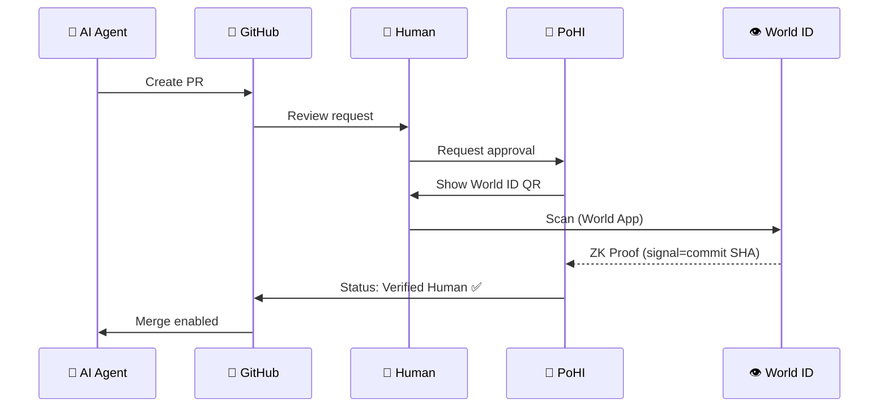

# 🔏 Proof of Human Intent (PoHI)

**AI executes. Humans authorize. Machines verify.**

[](https://pohi-demo.vercel.app/)
[](https://www.npmjs.com/package/pohi-core)
[](https://arxiv.org)
[](https://opensource.org/licenses/Apache-2.0)
[](https://github.com/pohi-protocol/pohi)

> **[Try the Live Demo](https://pohi-demo.vercel.app/)** - Verify your humanity with World ID

---

## 🎯 What is PoHI?

**Proof of Human Intent** is a protocol that creates cryptographically verifiable proof that a real human approved critical software actions.

> “Who approved this?”
> “The AI did.”
> This protocol ends that conversation.

```
World ID (ZK Proof) × Git Signing × Transparency Log
= Verifiable Human Approval
```

---

## 🔥 Why Now?

```
2024: GitHub Copilot writes code
2025: AI Agents create PRs autonomously  
2026: AI Agents deploy to production     ← We're heading here

Question: Can you PROVE a human approved it?
```

### The Problem

| Traditional | AI Era |
|-------------|--------|
| Human writes code | AI writes code |
| Human reviews | AI reviews |
| Human merges | **???** |

**Humans are shifting from "implementers" to "approvers."**

But there's no way to cryptographically verify that a human—not an AI—actually approved an action.

---

## 💡 How It Works

PoHI answers three questions:

| Question | Technology | Proof |
|----------|-----------|-------|
| **Who?** | PoP Providers | Unique human verification |
| **What?** | Git + DID | Specific commit approved |
| **When?** | SCITT Log | Immutable timestamp |

### Supported PoP Providers

| Provider | Verification Type | Sybil Resistance |
|----------|------------------|------------------|
| **World ID** | ZK proof (Orb/Device) | High |
| **Gitcoin Passport** | Web3 identity score | Medium |
| **BrightID** | Social graph verification | Medium |
| **Civic** | Gateway Pass | Medium |
| **Proof of Humanity** | Kleros registry | High |

### Architecture

```
┌─────────────────────────────────────────────────────────────┐
│                  Proof of Human Intent                       │
├─────────────────────────────────────────────────────────────┤
│                                                              │
│   ┌──────────┐    ┌──────────┐    ┌──────────┐              │
│   │  VERIFY  │───▶│   BIND   │───▶│  RECORD  │              │
│   │ "Human?" │    │  "What?" │    │ "Proof"  │              │
│   └──────────┘    └──────────┘    └──────────┘              │
│        │               │               │                     │
│        ▼               ▼               ▼                     │
│   ┌──────────┐    ┌──────────┐    ┌──────────┐              │
│   │   PoP    │    │ Git+DID  │    │  SCITT   │              │
│   │ Provider │    │ Signing  │    │   Log    │              │
│   └──────────┘    └──────────┘    └──────────┘              │
│                                                              │
└─────────────────────────────────────────────────────────────┘
```

### Approval Flow



---

## 🚀 Quick Start

### Prerequisites

- Node.js 18+
- World ID App ([Download](https://world.org/world-app))
- GitHub repository

### Installation

```bash
# Core library (chain-neutral, zero dependencies)
npm install pohi-core

# EVM utilities (for on-chain recording)
npm install pohi-evm

# SDK (full client for World Chain)
npm install pohi-sdk

# CLI tool
npm install -g pohi-cli
```

### Basic Usage

```typescript
import { createAttestation, computeSignal, validateAttestation } from 'pohi-core';

// Create an attestation
const attestation = createAttestation(
  // Subject: what is being approved
  {
    repository: 'owner/repo',
    commit_sha: 'abc123...',
    action: 'DEPLOY',
    description: 'Production deployment v2.0'
  },
  // Proof: evidence of human verification
  {
    method: 'world_id',
    verification_level: 'orb',
    nullifier_hash: '0x...',
    signal: computeSignal('owner/repo', 'abc123...')
  }
);

// Validate structure and hash integrity
const result = validateAttestation(attestation);
console.log(result.valid); // true
```

### CLI Usage

```bash
# Request human approval for a commit
pohi request --repo owner/repo --commit abc123

# Verify an existing attestation
pohi verify --repo owner/repo --commit abc123
```

### GitHub Action

```yaml
# .github/workflows/human-approval.yml
name: Require Human Approval

on:
  pull_request:
    types: [labeled]

jobs:
  verify:
    if: github.event.label.name == 'ready-to-merge'
    runs-on: ubuntu-latest
    steps:
      - uses: pohi-protocol/action@v1
        with:
          world-id-app: ${{ secrets.WORLD_ID_APP_ID }}
          required-level: orb
```

---

## 📦 Packages

| Package | Description | Status |
|---------|-------------|--------|
| [`pohi-core`](https://www.npmjs.com/package/pohi-core) | Core types & validation (zero deps) | ✅ v0.1.0 |
| [`pohi-evm`](https://www.npmjs.com/package/pohi-evm) | EVM utilities (keccak256, encodePacked) | ✅ v0.1.0 |
| [`pohi-sdk`](https://www.npmjs.com/package/pohi-sdk) | World Chain client | ✅ v0.1.0 |
| [`pohi-cli`](https://www.npmjs.com/package/pohi-cli) | Command-line tool | ✅ v0.1.0 |
| [`pohi-action`](https://www.npmjs.com/package/pohi-action) | GitHub Action | ✅ v0.1.0 |
| `pohi-contracts` | Solidity contracts (Foundry) | ✅ v0.1.0 |
| [`pohi-demo`](https://pohi-demo.vercel.app/) | Next.js + World ID demo | ✅ Live |

---

## 📄 Paper

**"Proof of Human Intent: Cryptographically Verifiable Human Approval for AI-Driven Software Development"**

- 📝 arXiv: In preparation (expected 2026)
- 📁 Source: [`paper/`](./paper/)

### Citation

```bibtex
@article{pohi2026,
  title={Proof of Human Intent: Cryptographically Verifiable Human Approval for AI-Driven Software Development},
  author={Ikko Eltociear Ashimine},
  journal={arXiv preprint},
  year={2026}
}
```

---

## 🔐 Security Model

### Threat Model

| Attack | Mitigation |
|--------|-----------|
| Sybil (fake identities) | World ID nullifier hash |
| Replay (reuse proof) | Commit SHA in signal |
| Tampering | Merkle tree proofs |
| Impersonation | ZK proof of personhood |

### Trust Assumptions

- World ID Orb correctly identifies unique humans
- Transparency log is append-only
- Cryptographic primitives are secure

---

## 🗺️ Roadmap

- [x] Architecture design
- [x] Paper draft (Abstract)
- [x] Core library implementation
- [x] EVM utilities package
- [x] SDK for World Chain
- [x] CLI tool
- [x] GitHub Action
- [x] Smart contracts (Foundry)
- [x] Demo application (Next.js + World ID)
- [x] npm publish (v0.1.0)
- [x] Live demo deployment
- [ ] arXiv submission
- [ ] Security review
- [ ] v1.0 release

---

## 📚 Related Work

| Technology | Purpose | Link |
|-----------|---------|------|
| World ID | Proof of personhood | [docs.world.org](https://docs.world.org/world-id) |
| IETF SCITT | Supply chain transparency | [datatracker.ietf.org](https://datatracker.ietf.org/wg/scitt/) |
| Sigstore | Keyless code signing | [sigstore.dev](https://sigstore.dev) |
| W3C DID | Decentralized identifiers | [w3.org](https://www.w3.org/TR/did-core/) |
| W3C VC | Verifiable credentials | [w3.org](https://www.w3.org/TR/vc-data-model/) |

---

## 🤝 Contributing

Contributions are welcome! This project is in early stages.

- ⭐ Star this repo to show support
- 🐛 Open issues for discussion
- 🔧 PRs welcome after v0.1 release

---

## 📜 License

[Apache License 2.0](LICENSE)

---

## 💬 Philosophy

> **Web3 is not for speculation.**
> **It's infrastructure for preserving human intent and accountability.**

As AI takes over implementation, humans become approvers.  
PoHI ensures that approval is real, verifiable, and permanent.

---

<p align="center">
  <b>Proof of Human Intent</b><br>
  <i>Your approval, cryptographically preserved for the future.</i>
</p>
