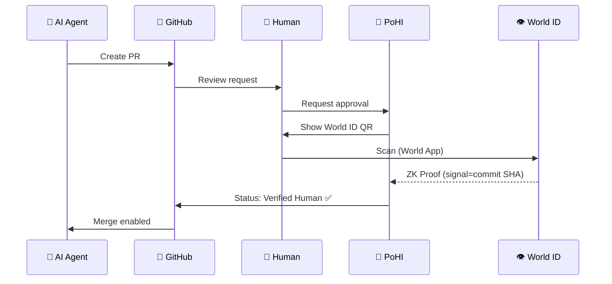

# 🔏 Proof of Human Intent (PoHI)

**AI executes. Humans authorize. Machines verify.**

[](https://pohi-demo.vercel.app/)
[](https://www.npmjs.com/package/pohi-core)
[](https://github.com/pohi-protocol/pohi/actions/workflows/ci.yml)
[](https://codecov.io/gh/pohi-protocol/pohi)
[](https://eprint.iacr.org/)
[](https://doi.org/10.5281/zenodo.20729026)
[](https://opensource.org/licenses/Apache-2.0)
[](https://github.com/pohi-protocol/pohi)

> **[Try the Live Demo](https://pohi-demo.vercel.app/)** - Verify your humanity with World ID

English | [日本語](README_ja.md)

---

## 🎯 What is PoHI?

**Proof of Human Intent** is a protocol that creates cryptographically verifiable proof that a real human approved critical software actions.

> “Who approved this?”
> “The AI did.”
> This protocol ends that conversation.

```
World ID (ZK Proof) × Git Signing × Transparency Log
= Verifiable Human Approval
```

---

## 🔥 Why Now?

```
2024: GitHub Copilot writes code
2025: AI Agents create PRs autonomously
2026: AI Agents deploy to production      ← We are here
2027: AI Agents operate autonomously      ← Next

Question: Can you PROVE a human approved it?
```

### The Problem

| Traditional | AI Era |
|-------------|--------|
| Human writes code | AI writes code |
| Human reviews | AI reviews |
| Human merges | **???** |

**Humans are shifting from "implementers" to "approvers."**

But there's no way to cryptographically verify that a human—not an AI—actually approved an action.

---

## 💡 How It Works

PoHI answers three questions:

| Question | Technology | Proof |
|----------|-----------|-------|
| **Who?** | PoP Providers | Unique human verification |
| **What?** | Git + DID | Specific commit approved |
| **When?** | SCITT Log | Immutable timestamp |

### Supported PoP Providers

| Provider | Verification Type | Sybil Resistance | Status |
|----------|------------------|------------------|--------|
| **World ID** | ZK proof (Orb/Device) | High | ✅ Tested |
| **Gitcoin Passport** | Web3 identity score | Medium | ✅ Tested |
| **BrightID** | Social graph verification | Medium | ✅ Implemented |
| **Civic** | Gateway Pass | Medium | ✅ Implemented |
| **Proof of Humanity** | Kleros registry | High | ✅ Implemented |
| **Holonym** | ZK identity (Gov ID/ePassport) | High | ✅ Implemented |
| **Idena** | AI-resistant CAPTCHA | High | ✅ Implemented |
| **Coinbase Verifications** | KYC attestation (EAS) | High | ✅ Implemented |
| **Humanity Protocol** | Palm biometric | High | ✅ Implemented |

> 📖 **[Provider Documentation](./docs/providers.md)** - Configuration, usage examples, and integration guides for each provider.

### Architecture

```
┌─────────────────────────────────────────────────────────────┐
│                  Proof of Human Intent                       │
├─────────────────────────────────────────────────────────────┤
│                                                              │
│   ┌──────────┐    ┌──────────┐    ┌──────────┐              │
│   │  VERIFY  │───▶│   BIND   │───▶│  RECORD  │              │
│   │ "Human?" │    │  "What?" │    │ "Proof"  │              │
│   └──────────┘    └──────────┘    └──────────┘              │
│        │               │               │                     │
│        ▼               ▼               ▼                     │
│   ┌──────────┐    ┌──────────┐    ┌──────────┐              │
│   │   PoP    │    │ Git+DID  │    │  SCITT   │              │
│   │ Provider │    │ Signing  │    │   Log    │              │
│   └──────────┘    └──────────┘    └──────────┘              │
│                                                              │
└─────────────────────────────────────────────────────────────┘
```

### Approval Flow


```mermaid
sequenceDiagram
    participant AI as 🤖 AI Agent
    participant GH as 🐙 GitHub
    participant Human as 👤 Human
    participant PoHI as 🔏 PoHI
    participant WorldID as 👁️ World ID

    AI->>GH: Create PR
    GH->>Human: Review request
    Human->>PoHI: Request approval
    PoHI->>Human: Show World ID QR
    Human->>WorldID: Scan (World App)
    WorldID-->>PoHI: ZK Proof (signal=commit SHA)
    PoHI->>GH: Status: Verified Human ✅
    GH->>AI: Merge enabled
```

---

## 🚀 Quick Start

### Prerequisites

- Node.js 18+
- World ID App ([Download](https://world.org/world-app))
- GitHub repository

### Installation

```bash
# Core library (chain-neutral, zero dependencies)
npm install pohi-core

# EVM utilities (for on-chain recording)
npm install pohi-evm

# SDK (full client for World Chain)
npm install pohi-sdk

# CLI tool
npm install -g pohi-cli
```

### Basic Usage

```typescript
import { createAttestation, computeSignal, validateAttestation } from 'pohi-core';

// Create an attestation
const attestation = createAttestation(
  // Subject: what is being approved
  {
    repository: 'owner/repo',
    commit_sha: 'abc123...',
    action: 'DEPLOY',
    description: 'Production deployment v2.0'
  },
  // Proof: evidence of human verification
  {
    method: 'world_id',
    verification_level: 'orb',
    nullifier_hash: '0x...',
    signal: computeSignal('owner/repo', 'abc123...')
  }
);

// Validate structure and hash integrity
const result = validateAttestation(attestation);
console.log(result.valid); // true
```

### CLI Usage

```bash
# Request human approval for a commit
pohi request --repo owner/repo --commit abc123

# Verify an existing attestation
pohi verify --repo owner/repo --commit abc123
```

### GitHub Action

```yaml
# .github/workflows/human-approval.yml
name: Require Human Approval

on:
  pull_request:
    types: [labeled]

jobs:
  verify:
    if: github.event.label.name == 'ready-to-merge'
    runs-on: ubuntu-latest
    steps:
      - uses: pohi-protocol/action@v1
        with:
          world-id-app: ${{ secrets.WORLD_ID_APP_ID }}
          required-level: orb
```

---

## 📦 Packages

| Package | Description | Status |
|---------|-------------|--------|
| [`pohi-core`](https://www.npmjs.com/package/pohi-core) | Core types & validation (zero deps) | ✅ v0.1.0 |
| [`pohi-evm`](https://www.npmjs.com/package/pohi-evm) | EVM utilities (keccak256, encodePacked) | ✅ v0.1.0 |
| [`pohi-sdk`](https://www.npmjs.com/package/pohi-sdk) | World Chain client | ✅ v0.1.0 |
| [`pohi-cli`](https://www.npmjs.com/package/pohi-cli) | Command-line tool | ✅ v0.1.0 |
| [`pohi-action`](https://www.npmjs.com/package/pohi-action) | GitHub Action | ✅ v0.1.0 |
| [`pohi-gitlab-ci`](./packages/gitlab-ci) | GitLab CI Component | ✅ v0.1.0 |
| [`pohi-bitbucket-pipe`](./packages/bitbucket-pipe) | Bitbucket Pipe | ✅ v0.1.0 |
| [`pohi-contracts`](./packages/contracts) | Solidity contracts (Foundry) | ✅ v0.1.0 |
| [`pohi-demo`](https://pohi-demo.vercel.app/) | Next.js + World ID demo | ✅ Live |

---

## 📄 Paper

**"Proof of Human Intent: Cryptographically Verifiable Human Approval for AI-Driven Software Development"**

- 📝 Zenodo (DOI): [`10.5281/zenodo.20729026`](https://doi.org/10.5281/zenodo.20729026) — canonical, citable preprint + reference implementation
- 📝 IACR ePrint: Submitted (pending review)
- 📝 arXiv: Pending endorsement (`cs.CR` / `cs.SE`)
- 📁 Source: [`paper/`](./paper/)

### Citation

```bibtex
@misc{pohi2026,
  title={Proof of Human Intent: Cryptographically Verifiable Human Approval for AI-Driven Software Development},
  author={Ikko Eltociear Ashimine},
  year={2026},
  doi={10.5281/zenodo.20729026},
  howpublished={Zenodo},
  url={https://doi.org/10.5281/zenodo.20729026}
}
```

---

## ⛓️ On-Chain Verification

On-chain attestation recording is **optional** and currently in development.

| Network | Status | Contract Address |
|---------|--------|------------------|
| World Chain Mainnet | 🔧 Coming Soon | TBD |
| World Chain Sepolia | ✅ Deployed | [`0xe3aF97c1Eb0c1Bfa872059270a947e8A10FFD9d1`](https://worldchain-sepolia.explorer.alchemy.com/address/0xe3af97c1eb0c1bfa872059270a947e8a10ffd9d1) |

> **Note**: PoHI works without on-chain recording. The core protocol uses off-chain attestations that can be independently verified. On-chain recording adds an additional immutable transparency layer.

---

## 🔐 Security Model

### Security Considerations

PoHI has undergone an initial self-review focusing on:
- **Replay attacks**: Mitigated by binding attestations to specific commit SHAs
- **Impersonation risks**: Prevented by World ID's ZK proof of personhood
- **CI/CD workflow integrity**: Isolated verification in ephemeral containers

For full security documentation, see [SECURITY.md](./SECURITY.md).

### Threat Model

| Attack | Mitigation |
|--------|-----------|
| Sybil (fake identities) | World ID nullifier hash |
| Replay (reuse proof) | Commit SHA in signal |
| Tampering | Merkle tree proofs |
| Impersonation | ZK proof of personhood |

### Trust Assumptions

- World ID Orb correctly identifies unique humans
- Transparency log is append-only
- Cryptographic primitives are secure

---

## 🗺️ Roadmap

- [x] Architecture design
- [x] Paper draft (Abstract)
- [x] Core library implementation
- [x] EVM utilities package
- [x] SDK for World Chain
- [x] CLI tool
- [x] GitHub Action
- [x] GitLab CI Component
- [x] Bitbucket Pipe
- [x] Smart contracts (Foundry)
- [x] Demo application (Next.js + World ID)
- [x] npm publish (v0.1.0)
- [x] Live demo deployment
- [x] Security self-review (see [SECURITY.md](./SECURITY.md))
- [x] IACR ePrint submission
- [ ] arXiv cross-posting
- [ ] External audit
- [ ] v1.0 release

---

## 📚 Related Work

| Technology | Purpose | Link |
|-----------|---------|------|
| World ID | Proof of personhood | [docs.world.org](https://docs.world.org/world-id) |
| IETF SCITT | Supply chain transparency | [datatracker.ietf.org](https://datatracker.ietf.org/wg/scitt/) |
| Sigstore | Keyless code signing | [sigstore.dev](https://sigstore.dev) |
| W3C DID | Decentralized identifiers | [w3.org](https://www.w3.org/TR/did-core/) |
| W3C VC | Verifiable credentials | [w3.org](https://www.w3.org/TR/vc-data-model/) |

---

## 📄 Research Paper

We have submitted our academic paper on PoHI to IACR ePrint (pending review). Cross-posting to arXiv is planned after ePrint publication.

**Seeking arXiv Endorsement**: If you have endorsement capability in `cs.CR` (Cryptography and Security) or `cs.SE` (Software Engineering), we would appreciate your support for future arXiv submission. Please [open an issue](https://github.com/pohi-protocol/pohi/issues/new) or contact us directly.

---

## 🛠️ Development

### Quick Start with Dev Container

[](https://codespaces.new/pohi-protocol/pohi)

1. Click the button above, or open in VS Code with Dev Containers extension
2. Wait for container to build (includes Node.js 20, Foundry, Playwright)
3. Run `npm run dev -w pohi-demo` to start the demo app

### Manual Setup

```bash
# Clone repository
git clone https://github.com/pohi-protocol/pohi.git
cd pohi

# Install dependencies
npm install

# Build all packages
npm run build

# Run tests
npm test

# Start demo app
npm run dev -w pohi-demo
```

---

## 🤝 Contributing

Contributions are welcome! This project is in early stages.

- ⭐ Star this repo to show support
- 🐛 Open issues for discussion
- 🔧 PRs welcome after v0.1 release

---

## 📜 License

[Apache License 2.0](LICENSE)

## 📋 Changelog

See [CHANGELOG.md](CHANGELOG.md) for version history and release notes.

---

## 💬 Philosophy

> **Web3 is not for speculation.**
> **It's infrastructure for preserving human intent and accountability.**

As AI takes over implementation, humans become approvers.
PoHI ensures that approval is real, verifiable, and permanent.

---

## 📜 Prior Art Notice

**Proof of Human Intent (PoHI) is published as prior art.**

This repository and associated publications define the original concept and reference implementation of PoHI. The intent is to enable open research, standardization, and interoperable implementations of cryptographically verifiable human intent in AI-driven systems.

See [NOTICE](NOTICE) for full attribution and prior art declaration.

---

## 🔌 PoHI-compatible Implementations

An implementation may describe itself as **"PoHI-compatible"** if it satisfies the following conditions:

### Definition

"PoHI-compatible" refers to systems or implementations that align with the **Proof of Human Intent (PoHI)** protocol as defined in this repository and associated publications.

PoHI-compatible implementations are expected to:

- Follow the core concept of **cryptographically verifiable human intent**
- Preserve the distinction between **human approval** and **automated actions**
- Support verifiable provenance of intent (e.g., signatures, logs, or proofs)
- Avoid treating PoHI as a mechanism for identity disclosure or KYC

### Reference Requirement

Implementations claiming PoHI compatibility are expected to reference this repository as the **original definition and prior art of PoHI**, and clearly document any deviations from the reference implementation.

### Non-Exclusivity

PoHI compatibility does **not** require strict conformance to a single implementation. PoHI is designed as an **open protocol concept**, and compatible implementations may vary in architecture or cryptographic primitives, provided the core intent model remains intact.

### Trademark Notice

"PoHI-compatible" is a descriptive term, not a trademark. Use of this term does not imply endorsement or affiliation with the PoHI authors.

> Projects are encouraged to describe their implementation as "PoHI-compatible" rather than redefining the PoHI concept independently.

For detailed compatibility levels (Core / Extended / Advanced), see [docs/pohi-compatibility.md](docs/pohi-compatibility.md).

---

<p align="center">
  <b>Proof of Human Intent</b><br>
  <i>Your approval, cryptographically preserved for the future.</i>
</p>
