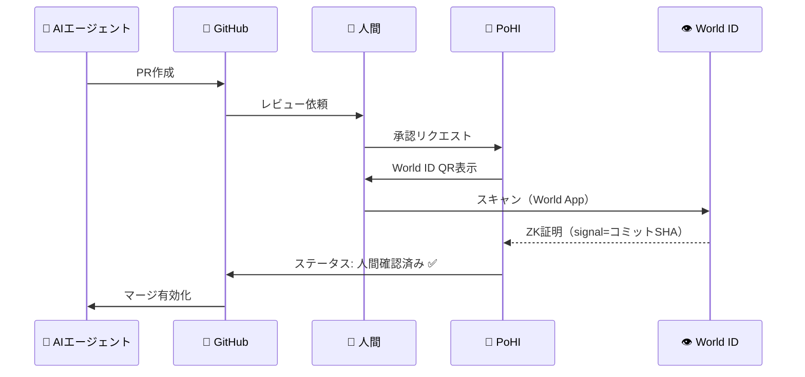

# 🔏 Proof of Human Intent (PoHI)

**AIが実行し、人間が承認し、機械が検証する。**

[](https://pohi-demo.vercel.app/)
[](https://www.npmjs.com/package/pohi-core)
[](https://github.com/pohi-protocol/pohi/actions/workflows/ci.yml)
[](https://codecov.io/gh/pohi-protocol/pohi)
[](https://eprint.iacr.org/)
[](https://opensource.org/licenses/Apache-2.0)
[](https://github.com/pohi-protocol/pohi)

> **[ライブデモを試す](https://pohi-demo.vercel.app/)** - World IDで人間性を検証

[English](README.md) | 日本語

---

## 🎯 PoHIとは？

**Proof of Human Intent（人間の意思証明）** は、重要なソフトウェアアクションを実際の人間が承認したことを暗号学的に証明するプロトコルです。

> 「誰が承認したの？」
> 「AIがやりました。」
> このプロトコルは、この会話を終わらせます。

```
World ID（ZK証明）× Git署名 × 透明性ログ
= 検証可能な人間の承認
```

---

## 🔥 なぜ今なのか？

```
2024: GitHub Copilotがコードを書く
2025: AIエージェントが自律的にPRを作成
2026: AIエージェントが本番環境にデプロイ     ← ここに向かっている

疑問: 人間が承認したことを証明できますか？
```

### 問題

| 従来 | AI時代 |
|------|--------|
| 人間がコードを書く | AIがコードを書く |
| 人間がレビューする | AIがレビューする |
| 人間がマージする | **???** |

**人間は「実装者」から「承認者」へとシフトしています。**

しかし、AIではなく人間が実際にアクションを承認したことを暗号学的に検証する方法がありません。

---

## 💡 仕組み

PoHIは3つの質問に答えます：

| 質問 | 技術 | 証明 |
|------|------|------|
| **誰が？** | PoPプロバイダー | ユニークな人間の検証 |
| **何を？** | Git + DID | 特定のコミットの承認 |
| **いつ？** | SCITTログ | 改ざん不可能なタイムスタンプ |

### 対応PoPプロバイダー

| プロバイダー | 検証タイプ | Sybil耐性 | ステータス |
|-------------|-----------|-----------|-----------|
| **World ID** | ZK証明（Orb/Device） | 高 | ✅ テスト済み (2026-01) |
| **Gitcoin Passport** | Web3アイデンティティスコア | 中 | ✅ テスト済み (2025-12, スコア: 54.33) |
| **BrightID** | ソーシャルグラフ検証 | 中 | ✅ 実装済み |
| **Civic** | Gateway Pass | 中 | ✅ 実装済み |
| **Proof of Humanity** | Klerosレジストリ | 高 | ✅ 実装済み |

> 📖 **[プロバイダードキュメント](./docs/providers.md)** - 各プロバイダーの設定、使用例、統合ガイド

### アーキテクチャ

```
┌─────────────────────────────────────────────────────────────┐
│                  Proof of Human Intent                       │
├─────────────────────────────────────────────────────────────┤
│                                                              │
│   ┌──────────┐    ┌──────────┐    ┌──────────┐              │
│   │  検証    │───▶│   紐付け  │───▶│   記録   │              │
│   │ "人間？" │    │  "何を？" │    │ "証明"   │              │
│   └──────────┘    └──────────┘    └──────────┘              │
│        │               │               │                     │
│        ▼               ▼               ▼                     │
│   ┌──────────┐    ┌──────────┐    ┌──────────┐              │
│   │   PoP    │    │ Git+DID  │    │  SCITT   │              │
│   │ Provider │    │ Signing  │    │   Log    │              │
│   └──────────┘    └──────────┘    └──────────┘              │
│                                                              │
└─────────────────────────────────────────────────────────────┘
```

### 承認フロー



---

## 🚀 クイックスタート

### 前提条件

- Node.js 18+
- World IDアプリ（[ダウンロード](https://world.org/world-app)）
- GitHubリポジトリ

### インストール

```bash
# コアライブラリ（チェーン中立、依存関係ゼロ）
npm install pohi-core

# EVMユーティリティ（オンチェーン記録用）
npm install pohi-evm

# SDK（World Chainフルクライアント）
npm install pohi-sdk

# CLIツール
npm install -g pohi-cli
```

### 基本的な使い方

```typescript
import { createAttestation, computeSignal, validateAttestation } from 'pohi-core';

// アテステーションを作成
const attestation = createAttestation(
  // Subject: 承認対象
  {
    repository: 'owner/repo',
    commit_sha: 'abc123...',
    action: 'DEPLOY',
    description: '本番デプロイ v2.0'
  },
  // Proof: 人間検証の証拠
  {
    method: 'world_id',
    verification_level: 'orb',
    nullifier_hash: '0x...',
    signal: computeSignal('owner/repo', 'abc123...')
  }
);

// 構造とハッシュの整合性を検証
const result = validateAttestation(attestation);
console.log(result.valid); // true
```

### CLIの使い方

```bash
# コミットに対する人間の承認をリクエスト
pohi request --repo owner/repo --commit abc123

# 既存のアテステーションを検証
pohi verify --repo owner/repo --commit abc123
```

### GitHub Action

```yaml
# .github/workflows/human-approval.yml
name: 人間の承認を要求

on:
  pull_request:
    types: [labeled]

jobs:
  verify:
    if: github.event.label.name == 'ready-to-merge'
    runs-on: ubuntu-latest
    steps:
      - uses: pohi-protocol/action@v1
        with:
          world-id-app: ${{ secrets.WORLD_ID_APP_ID }}
          required-level: orb
```

---

## 📦 パッケージ

| パッケージ | 説明 | ステータス |
|-----------|------|-----------|
| [`pohi-core`](https://www.npmjs.com/package/pohi-core) | コア型と検証（依存関係ゼロ） | ✅ v0.1.0 |
| [`pohi-evm`](https://www.npmjs.com/package/pohi-evm) | EVMユーティリティ（keccak256, encodePacked） | ✅ v0.1.0 |
| [`pohi-sdk`](https://www.npmjs.com/package/pohi-sdk) | World Chainクライアント | ✅ v0.1.0 |
| [`pohi-cli`](https://www.npmjs.com/package/pohi-cli) | コマンドラインツール | ✅ v0.1.0 |
| [`pohi-action`](https://www.npmjs.com/package/pohi-action) | GitHub Action | ✅ v0.1.0 |
| [`pohi-gitlab-ci`](./packages/gitlab-ci) | GitLab CIコンポーネント | ✅ v0.1.0 |
| [`pohi-bitbucket-pipe`](./packages/bitbucket-pipe) | Bitbucket Pipe | ✅ v0.1.0 |
| [`pohi-contracts`](./packages/contracts) | Solidityコントラクト（Foundry） | ✅ v0.1.0 |
| [`pohi-demo`](https://pohi-demo.vercel.app/) | Next.js + World IDデモ | ✅ 公開中 |

---

## 📄 論文

**「Proof of Human Intent: AI駆動ソフトウェア開発における暗号学的に検証可能な人間の承認」**

- 📝 IACR ePrint: 投稿済み（審査中）
- 📝 arXiv: ePrint公開後に予定
- 📁 ソース: [`paper/`](./paper/)

### 引用

```bibtex
@misc{pohi2026,
  title={Proof of Human Intent: Cryptographically Verifiable Human Approval for AI-Driven Software Development},
  author={Ikko Eltociear Ashimine},
  year={2026},
  howpublished={IACR Cryptology ePrint Archive}
}
```

---

## ⛓️ オンチェーン検証

オンチェーンでのアテステーション記録は**オプション**であり、現在開発中です。

| ネットワーク | ステータス | コントラクトアドレス |
|-------------|-----------|---------------------|
| World Chain Mainnet | 🔧 Coming Soon | TBD |
| World Chain Sepolia | ✅ デプロイ済み | [`0xe3aF97c1Eb0c1Bfa872059270a947e8A10FFD9d1`](https://worldchain-sepolia.explorer.alchemy.com/address/0xe3af97c1eb0c1bfa872059270a947e8a10ffd9d1) |

> **注意**: PoHIはオンチェーン記録なしでも動作します。コアプロトコルは独立して検証可能なオフチェーンアテステーションを使用します。オンチェーン記録は追加の不変透明性レイヤーを提供します。

---

## 🔐 セキュリティモデル

### セキュリティに関する考慮事項

PoHIは以下に焦点を当てた初期セルフレビューを実施しました：
- **リプレイ攻撃**: 特定のコミットSHAにアテステーションを紐付けることで軽減
- **なりすましリスク**: World IDのZKプルーフ・オブ・パーソンフッドで防止
- **CI/CDワークフローの整合性**: エフェメラルコンテナでの分離検証

完全なセキュリティドキュメントは[SECURITY.md](./SECURITY.md)を参照してください。

### 脅威モデル

| 攻撃 | 軽減策 |
|------|--------|
| Sybil（偽ID） | World ID nullifierハッシュ |
| リプレイ（証明の再利用） | シグナル内のコミットSHA |
| 改ざん | Merkleツリー証明 |
| なりすまし | ZKプルーフ・オブ・パーソンフッド |

### 信頼の前提

- World ID Orbが一意の人間を正しく識別する
- 透明性ログが追記専用である
- 暗号プリミティブが安全である

---

## 🗺️ ロードマップ

- [x] アーキテクチャ設計
- [x] 論文ドラフト（概要）
- [x] コアライブラリ実装
- [x] EVMユーティリティパッケージ
- [x] World Chain用SDK
- [x] CLIツール
- [x] GitHub Action
- [x] GitLab CIコンポーネント
- [x] Bitbucket Pipe
- [x] スマートコントラクト（Foundry）
- [x] デモアプリケーション（Next.js + World ID）
- [x] npm公開（v0.1.0）
- [x] ライブデモデプロイ
- [x] セキュリティセルフレビュー（[SECURITY.md](./SECURITY.md)参照）
- [x] IACR ePrint投稿
- [ ] arXivクロスポスト
- [ ] 外部監査
- [ ] v1.0リリース

---

## 📚 関連技術

| 技術 | 目的 | リンク |
|------|------|--------|
| World ID | プルーフ・オブ・パーソンフッド | [docs.world.org](https://docs.world.org/world-id) |
| IETF SCITT | サプライチェーン透明性 | [datatracker.ietf.org](https://datatracker.ietf.org/wg/scitt/) |
| Sigstore | キーレスコード署名 | [sigstore.dev](https://sigstore.dev) |
| W3C DID | 分散型識別子 | [w3.org](https://www.w3.org/TR/did-core/) |
| W3C VC | 検証可能な資格情報 | [w3.org](https://www.w3.org/TR/vc-data-model/) |

---

## 📄 研究論文

PoHIに関する学術論文をIACR ePrintに投稿しました（審査中）。ePrint公開後、arXivへのクロスポストを予定しています。

**arXivエンドースメント募集中**: `cs.CR`（暗号とセキュリティ）または`cs.SE`（ソフトウェア工学）のエンドースメント権限をお持ちの方は、将来のarXiv投稿のためにご協力いただけると幸いです。[Issueを作成](https://github.com/pohi-protocol/pohi/issues/new)するか、直接ご連絡ください。

---

## 🛠️ 開発

### Dev Containerでクイックスタート

[](https://codespaces.new/pohi-protocol/pohi)

1. 上のボタンをクリック、またはVS CodeのDev Containers拡張機能で開く
2. コンテナのビルドを待つ（Node.js 20、Foundry、Playwright含む）
3. `npm run dev -w pohi-demo` でデモアプリを起動

### 手動セットアップ

```bash
# リポジトリをクローン
git clone https://github.com/pohi-protocol/pohi.git
cd pohi

# 依存関係をインストール
npm install

# 全パッケージをビルド
npm run build

# テストを実行
npm test

# デモアプリを起動
npm run dev -w pohi-demo
```

---

## 🤝 コントリビューション

コントリビューションを歓迎します！このプロジェクトは初期段階です。

- ⭐ このリポジトリにスターを付けてサポートを表明
- 🐛 ディスカッション用のIssueを開く
- 🔧 v0.1リリース後にPRを歓迎

---

## 📜 ライセンス

[Apache License 2.0](LICENSE)

## 📋 変更履歴

バージョン履歴とリリースノートは[CHANGELOG.md](CHANGELOG.md)を参照してください。

---

## 💬 哲学

> **Web3は投機のためではない。**
> **それは人間の意思と責任を保存するためのインフラである。**

AIが実装を担う時代、人間は承認者になる。
PoHIは、その承認が本物であり、検証可能であり、永続的であることを保証します。

---

<p align="center">
  <b>Proof of Human Intent</b><br>
  <i>あなたの承認を、暗号学的に未来へ。</i>
</p>
